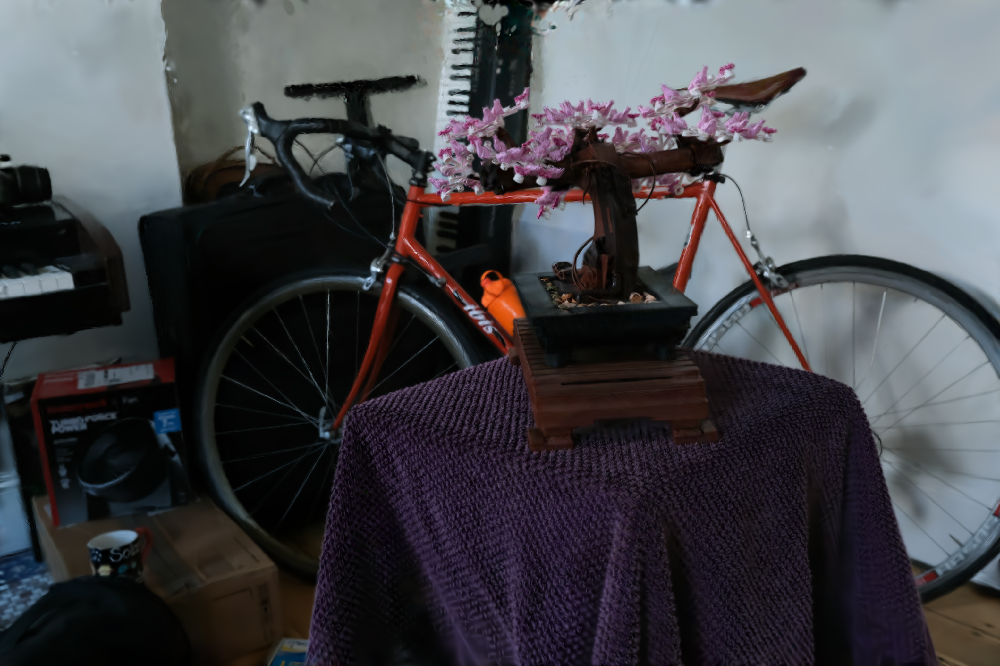

# GaussianSplattingRenderer

A lightweight C++ renderer for Gaussian Splatting scenes.

## Overview

This project renders a trained Gaussian Splat scene from a `.gsbin` file.
The expected workflow is:

1. Train a scene with `gsplat` and export a checkpoint (`.pt`).
2. Convert that `.pt` checkpoint to `.gsbin` using this repo's converter script.
3. Build this C++ project and render.

## 1) Train a Scene with gsplat 🧠

Use the official `gsplat` repository:

- https://github.com/nerfstudio-project/gsplat

Train your target scene there and keep the produced checkpoint file (for example: `ckpt_4999_rank0.pt`).

## 2) Convert `.pt` to `.gsbin` 🔄

From this repository root, run:

```bash
python3 convert_gsplat_ckpt_to_gsbin.py /path/to/ckpt_4999_rank0.pt
```

By default, this writes:

```text
data/model.gsbin
```

## 3) Clone This Repo (with submodules) 📦

Clone with submodules:

```bash
git clone --recurse-submodules https://github.com/robofar/GaussianSplattingRenderer.git
cd GaussianSplattingRenderer
```

If you already cloned without submodules:

```bash
git submodule update --init --recursive
```

## 4) Build ⚙️

### Dependencies

- C++17 compiler (`g++`/`clang++`)
- CMake >= 3.16
- Eigen3
- libpng

On Ubuntu/Debian:

```bash
sudo apt update
sudo apt install -y cmake build-essential libeigen3-dev libpng-dev
```

Build commands:

```bash
cmake -S . -B build
cmake --build build -j
```

## 5) Run ▶️

Make sure these files exist:

- `data/model.gsbin`
- `config/camera.yaml` (or update `src/main.cpp` to your config path)

All camera parameters must be defined in `camera.yaml`.

Run:

```bash
./build/gaussian_demo
```

Expected output image path:

```text
output/rendered.png
```

## Example Rendering Result 🖼️


